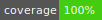

<div align="center">

# nexo-pro

:point_right: Unofficial Node.js connector for the Nexo Pro APIs, with TypeScript & browser support. :point_left:

[](http://isitmaintained.com/project/aussedatlo/nexo-pro 'Percentage of issues still open')
[](https://github.com/aussedatlo/nexo-pro/blob/master/LICENSE.md)
[][1]
[][1]
[][1]
[](https://GitHub.com/aussedatlo/nexo-pro/graphs/contributors/)
[][1]
[](https://github.com/aussedatlo/nexo-pro/actions/workflows/main.yml)
[](shields/coverage.svg)

[1]: https://www.npmjs.com/package/nexo-pro

</div>

<div align="center">

[Report Bug](https://github.com/aussedatlo/nexo-pro/issues) · [Request Feature](https://github.com/aussedatlo/nexo-pro/issues)

</div>

## :wrench: Installation

```shell
yarn add nexo-pro
```

## :plunger: Examples

copy the `.env.template` file in `.env` and fills the variables.

run an example using `ts-node`:

```shell
ts-node examples/account.ts
```

## :open_book: Documentation

Check out the Nexo Pro API Documentation

- [Nexo Pro API Documentation](https://pro.nexo.io/api-doc-pro)

Create API credential at Nexo Pro API Management

- [Nexo Pro API Management](https://pro.nexo.io/api-management)

## :label: REST API Client

```typescript
import Client from 'nexo-pro';

const client = Client({
  api_key: key,
  api_secret: secret,
});

// infos
await client.getAccountSummary();
await client.getPairs();
await client.getQuote({ pair: 'BTC/USDT', amount: 10, side: 'buy' });

// orders
await client.placeOrder({
  pair: 'BTC/USDT',
  side: 'buy',
  type: 'market',
  quantity: 0.02,
});
await client.cancelOrder({ orderId: '<order_id>' });
await client.cancelAllOrders({ pair: 'BTC/USDT' });
await client.placeTriggerOrder({
  pair: 'BTC/USDT',
  side: 'buy',
  triggerType: 'stopLoss',
  amount: 0.02,
  triggerPrice: 18000,
});

await client.placeAdvancedOrder({
  pair: 'BTC/USDT',
  side: 'buy',
  triggerType: 'stopLoss',
  amount: 0.02,
  triggerPrice: 18000,
});
await client.placeTWAPOrder({
  pair: 'BTC/USDT',
  quantity: 0.02,
  side: 'buy',
  exchanges: [''],
  split: 10,
  executionInterval: 200,
});
await client.getOrders({
  pairs: ['BTC/USDT'],
  startDate: 0,
  endDate: Date.now(),
  pageNum: 0,
  pageSize: 5,
});
await client.getOrderDetails({ id: '<order_id>' });

// others
await client.getTrades({
  pairs: ['BTC/USDT'],
  startDate: 0,
  endDate: Date.now(),
  pageNum: 0,
  pageSize: 5,
});
await client.getTransaction({ transactionId: 0 });

// futures
await client.getFuturesInstruments();
await client.getFuturesPosition({ status: 'active' });
await client.placeFuturesOrder({
  instrument: 'BTC/USDT',
  positionAction: 'open',
  positionSide: 'long',
  type: 'market',
  quantity: 0.02,
});
```

## :test_tube: Tests

copy the `.env.template` file in `.env` and fills the variables.

run all the tests:

```shell
yarn test
```

## :package: Browser Usage

Build a bundle using webpack:

```shell
yarn install
yarn build
yarn pack
```

The bundle can be found in `./`.

---

## :wave: Contributions & Pull Requests

Contributions are encouraged, I will review any incoming pull requests.
Be sur to run `yarn test` to run all tests and `yarn prettier` to run the prettier.

## :warning: Disclamer

This is an unofficial NodeJS wrapper for the Nexo Pro exchange REST API v1. I am in no way affiliated with Nexo, use at your own risk.
